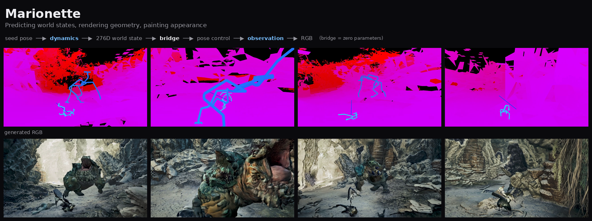
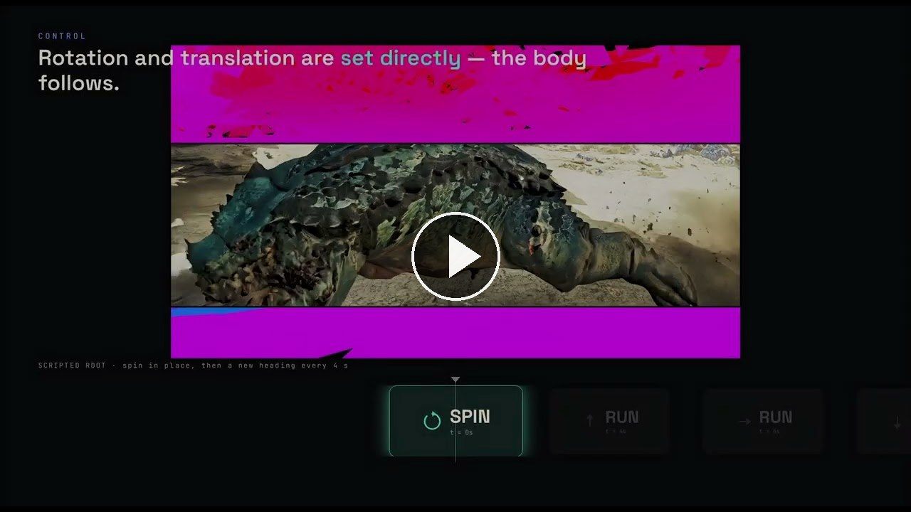

<div align="center">

<h1>Marionette：预测世界状态，渲染几何，绘制外观</h1>

<p><a href="https://alayalab.ai/"><b>Alaya Lab</b></a></p>

<p>
  <a href="README.md"></a>
  <a href="README_zh.md"></a>
</p>

<p>
  <a href="https://arxiv.org/abs/2608.14530"></a>
  <a href="https://alayalab.github.io/Marionette/"></a>
  <a href="https://github.com/AlayaLab/Marionette"></a>
  <a href="https://huggingface.co/AlayaLab/Marionette"></a>
  <a href="https://github.com/AlayaLab/WildWorld"></a>
</p>



</div>

> 一个建模世界本身、而不是建模其像素的世界模型：动力学模型预测显式的关节化状态，零参数的桥接把状态变成几何，视频模型只负责在其上绘制外观。

<p align="center">
  <a href="https://youtu.be/bLLtwXVcqEc"></a>
  <br><a href="https://youtu.be/bLLtwXVcqEc"><b>&#9654; 观看概览视频</b></a>
</p>

---

## 📰 更新

- **[2026-08-17]** 论文上线 arXiv —— [2608.14530](https://arxiv.org/abs/2608.14530)；概览视频
  [YouTube](https://youtu.be/bLLtwXVcqEc)。
- **[2026-08-13]** 推理代码、运行资产与可控性演示发布。
- **[2026-08-13]** 项目主页发布。

## 🚀 发布计划

- [x] 项目主页
- [x] 推理代码 —— 完整三阶段管线
- [x] 运行资产 —— 种子、地形、参考帧
- [x] 可控性演示，以及校验它的断言脚本
- [x] 论文 —— [arXiv:2608.14530](https://arxiv.org/abs/2608.14530)
- [ ] 预训练权重 —— 🤗 [`AlayaLab/Marionette`](https://huggingface.co/AlayaLab/Marionette)（上传中）
- [ ] 训练代码

交互式游戏世界模型通常直接在像素或隐空间里自回归"外观"。长时一致性、可控性、持久性于是只能作为序列模型的副产品浮现出来，也就相应地脆弱。

Marionette 把世界模型拆成三段，**只有第一段和第三段带权重**：

```
种子姿态 ──▶ 动力学 ──▶ 276 维世界状态 ──▶ 桥接 ──▶ 姿态控制视频 ──▶ 观测 ──▶ RGB
             ActionGPT                    零参数、                  控制条件视频扩散
             + PoseGPT                    确定性                    分块接力 rollout
```

动力学模型预测显式的关节化状态；桥接用固定的几何运算把状态变成几何，没有任何学习参数；观测模型只负责在其上绘制外观。

**[Gallery](gallery/)** —— 先看效果，再决定要不要下载 34 GB。

## 快速开始

```bash
bash fetch_weights.sh        # 我们的模型权重，约 10.5 GB
bash fetch_base_model.sh     # 第三方基座模型，约 23 GB
bash run_demo.sh             # -> samples_out/.../rollout.mp4
```

除权重外的一切都已在 clone 里。

观测阶段需要一块约 40 GB 显存的 GPU。

更便宜、也更有意思的一半是**可控性**，只出姿态、不跑扩散模型，每个约 90 秒，不需要基座模型：

```bash
bash demos/control_demos.sh          # 详见 demos/README.md
python3 demos/check_counterfactual.py
```

## 两套环境

两个阶段**无法共用一个环境**，这是这里最容易浪费一下午的地方：

- **阶段一（桥接）** 需要 `moderngl` 与 EGL 上下文，跑在 `python3.12` 下；见 `requirements-bridge.txt`。
- **阶段二（观测）** 需要 `torch>=2.8`、`diffusers`、`decord`；见 `requirements.txt`。而 `decord` 在桥接那套 python 上装不起来——这正是它们必须分成两套环境、两个脚本的原因。

## 许可

本项目采用**双许可**，因为代码与数据派生物的权利并不相同：

| | 许可 | 文件 |
|---|---|---|
| 代码 | Apache License 2.0 | [`LICENSE`](LICENSE) |
| 模型权重与运行资产 | 仅限非商业研究用途，不得再分发 | [`LICENSE.assets`](LICENSE.assets) |

权重与资产派生自 [WildWorld](https://github.com/AlayaLab/WildWorld) 数据集，该数据集以非商业研究用途发布且不允许再分发，相关条款因此传递到由其派生的一切产物。

源游戏内容的权利归其发行方所有，本项目不对该内容授予任何权利。**本项目中有两个文件是未经修改的游戏录像**，而非模型输出：`data/first_frame_ref.mp4` 与 `data/demo/aligned_ref.mp4` —— 观测模型需要一帧参考图作为条件，这两个文件提供它。它们是与语料同源录像的短片段，受上述"仅限非商业研究"条款约束。此外分发的一切（种子状态、地形扫描、姿态视频、生成结果与展示静图）均为数值派生物或模型输出。

第三方组件、来源与许可见 [`THIRD_PARTY_LICENSES.md`](THIRD_PARTY_LICENSES.md)；`observation/` 目录下 vendored 的上游代码及其修改记录见 [`observation/PROVENANCE.md`](observation/PROVENANCE.md)。基座模型**不随本项目分发**，由 `fetch_base_model.sh` 从原始来源获取，以便其许可与出处始终跟随它本身。

## 引用

```bibtex
@article{meng2026marionette,
  title   = {Marionette: Predicting World States, Rendering Geometry, Painting Appearance},
  author  = {Meng, Zian and Li, Zhen and Li, Chuanhao and Li, Qiang and Zhang, Kaipeng},
  journal = {arXiv preprint arXiv:2608.14530},
  year    = {2026}
}
```
