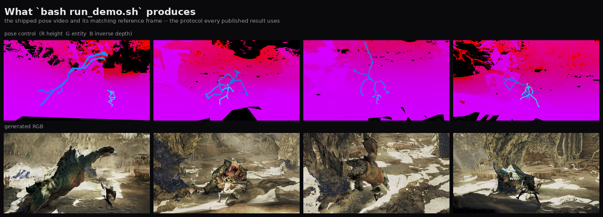
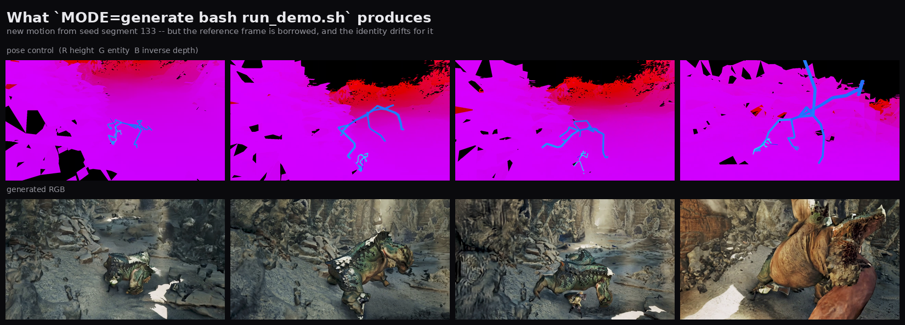
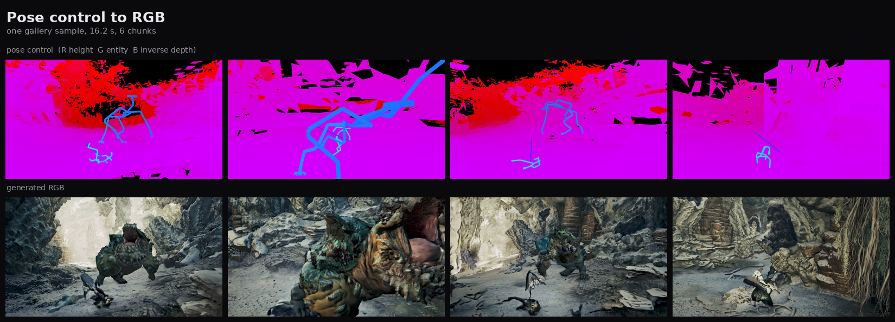
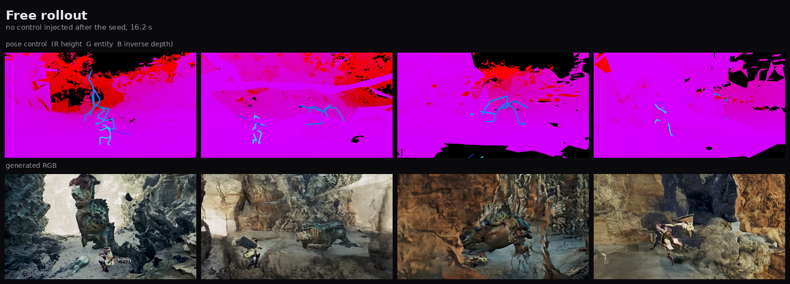
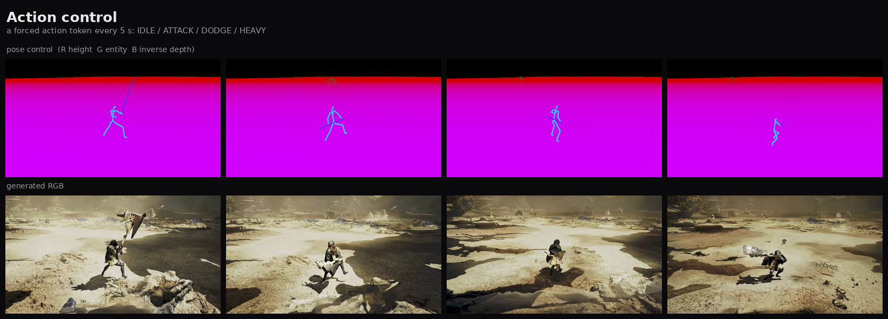
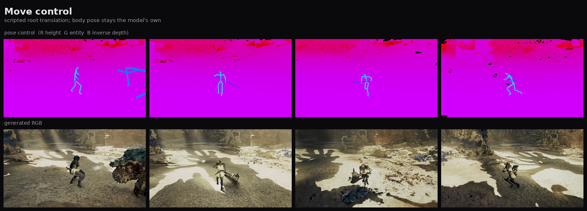
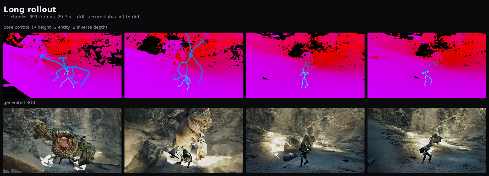

# Gallery

Everything here comes from the released checkpoint, `observation/diffusion_pytorch_model.safetensors`
the released checkpoint, at the settings the demo script uses by default:

> 704×1280 · 40 steps · guidance 6.0 · seed 43 · 81-frame chunks · 30 fps · chunk-relay

Each sheet has the **pose control on the top row and the model's RGB directly beneath it**, at
the same instants. The pose row is what the model was told; the RGB row is what it painted.
That pairing is the claim, so it is what the gallery shows.

Playable, full-resolution versions of all of these are on the project page. Contact sheets are
here because GitHub will not play a repo-relative mp4 inside a README, and committing several
hundred MB of video that nobody can watch without cloning is worse than a still.

To make your own instead of looking at ours: `bash run_demo.sh`.

---

## What you get from `run_demo.sh`



The default. A pose video and the ground-truth frame for the moment it starts at, shipped as a
pair, which is the condition the observation model was trained under
(`control_ref_image=first_frame`). The assets repo also carries our own 6-chunk render of this
input, so a run can be compared against a known result rather than judged by eye.



`MODE=generate`: the dynamics model runs here and now, so the motion is new. But the release
ships seed *states* without their footage, so there is no ground-truth frame for where this
pose begins — the reference has to be borrowed from another moment, and the model is handed two
conditions that contradict each other. Watch the last panel: the monster's identity shifts at
the chunk boundary. That is the mismatch, not the model's ceiling.

Both are real output from the released checkpoint. They are both here because the difference
between them is a property of the *protocol*, and showing only the good one would misattribute
it to the weights.

---

## Pose control → RGB



One of six wipe-comparison samples on the project page. The pose video is **generated by the
dynamics model**, not extracted from footage: it is seeded with a short prefix of real state
(64 frames at 20 fps, about 3 s) and everything after that is prediction. The observation model
then paints it. `run_demo.sh` does the same thing with a 32-frame seed.

Note what is and is not in the control signal. R is a world-height band, G is an entity/skeleton
id, B is inverse depth. There is terrain geometry and there are two skeletons — and there is no
texture, no material, no lighting, and no identity beyond an integer. Everything that makes the
monster look like *that* monster is coming from the first-frame reference and the caption.

## Free rollout, no control after the seed



The same conditions the project page uses to compare against three other systems: seed it, then
inject nothing. What holds the character together over 16 seconds is the dynamics model staying
on its own manifold, not the video model remembering.

## Action control



A forced action token every 5 s — IDLE, ATTACK, DODGE, HEAVY. The token is overridden in the
dynamics stage; the observation model is never told that anything special happened. Control
survives the whole pipeline because it is applied where the state lives.

Obedience is partial and that is a property of the model, not of the demo: DODGE holds for about
1.5 s, HEAVY reads as a re-trigger rather than a sustained state. The published clip is the
unedited result.

## Move control



Scripted root translation — two spins in place, then a new screen-relative heading every 2 s at
2.5 m/s. Only *where the character is* is overridden; the body pose stays whatever the model
predicts. Two things are being controlled independently and only one of them is being written.

## Long rollout — 11 chunks, 891 frames, 29.7 s



Left to right is 30 seconds of relay, each chunk conditioned on the last frame of the one
before. This is the sheet to look at if you want to see the failure mode: appearance error
compounds with horizon, and the honest thing to report is where it becomes visible rather than
to crop before it does.

---

## What is *not* rendered from this checkpoint

The project page also carries a 26-species montage. It is rendered from an **earlier
checkpoint** and deliberately not refreshed: the released checkpoint's last 2000 steps are on a
single-species corpus, so it is the narrowest checkpoint in the lineage, and re-rendering a
breadth claim on it would be backwards.

The comparison page likewise carries three systems that are not ours. Those are other models'
outputs and are not regenerated here.

## Rebuilding these sheets

```bash
python3 gallery/make_contact_sheets.py             # all
python3 gallery/make_contact_sheets.py cmp_ours    # one
```

Reads the full-resolution masters from the cluster delivery tree, so it does not run from a
clean clone. The outputs are committed.
